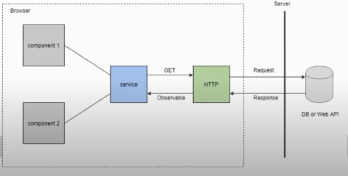
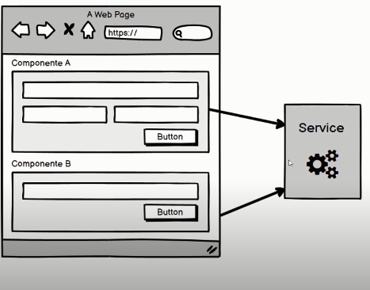
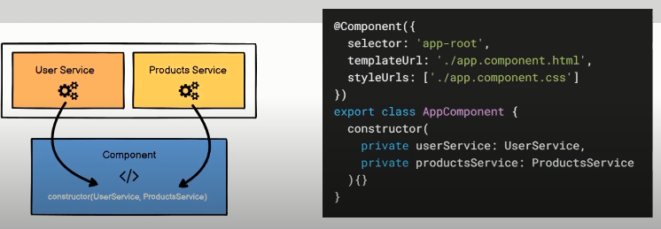
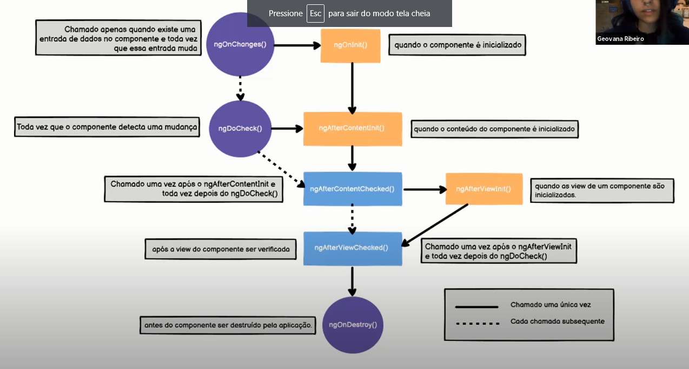
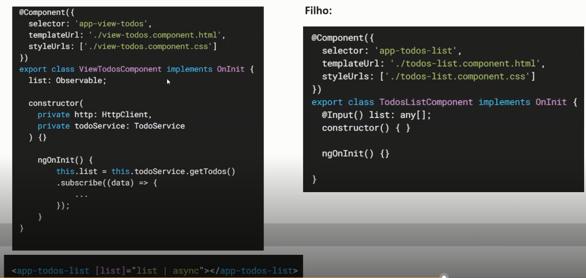
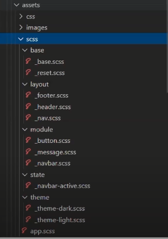
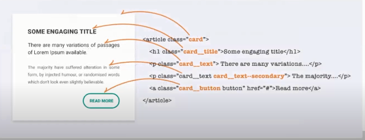
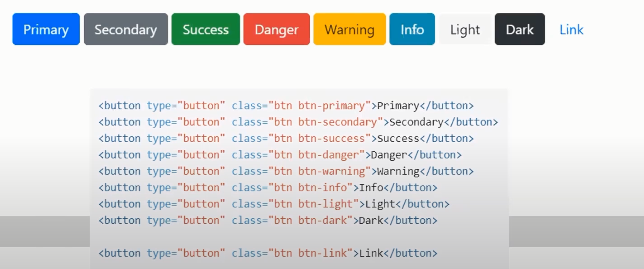

# Projeto SPA - Single Page Application

## :scroll: Sumário

- [Sobre](#about)
- [Estrutura](#structure)
- [Conceitos](#learned)

## :computer: Sobre 

> Bootcamp 🚀 = Avanade Angular Developer

 
  

  
Projeto consiste em dashboard administrativo com lista de funcionários de empresa.

  

  <b>Checklist</b>
  <ul>
  <li>✔️ Criar aplicação angular</li>
  <li>✔️ 3 Componentes</li>
  <li>✔️ 4 Componentes do Angular Material</li>
  <li>✔️Interação através de interpolação e data binding</li>
  </ul>
  

 :globe_with_meridians: DEPLOY

## :file_folder: Estrutura do projeto 

  
APP

  

  <pre>
 ├── app
    ├── features                # Pasta de componentes de aplicação
    ├── shared                  # Arquivos compartilhados globalmente
        ├── material            # imports do Angular Material
        └── material
    ├── app-routing.module.ts   # Rotas da aplicação
    ├── app.component.css       # 
    ├── app.component.spec.ts   # 
    ├── app.compoenent.ts       # 
    └── app.module.ts           #   
  </pre> 
  

## :memo: Conceitos aprendidos 

  
Implementação do Angular Material

  
Optei por dividir os imports em apenas 1 módulo para organização em importação e divisão de biblioteca com componentes do sistema e importações do angular.

  
Routes

  
O arquivo app-routing-module contém as rotas e renderização de componentes.

  
Data Binding

  

  Forma de associar informações lógicas entre o template e o componente, ou vice-versa.
Formas existentes:
  <ul>
  <li>Interpolação: {{ valor }}</li>
  <li>Property Binding: [propriedade]="valor"</li>
  <li>Event Binding: (evento)="handler"</li>
  <li>Two-Way Data Binding: [(ngModel)]="propriedade"</li>
  </ul>
  

  
Diretivas

  

  Marcadores do elemento DOM, foram utilizados no projeto
  <ul>
  <li>ngIf</li>
  <li>ngFor</li>
  </ul>
  

  
Event Emitters

  

  Comunicação de dados entre componentes.
  <ul>
  <li>@Input: Receber dados do componente pai</li>
  <li>@Output: Enviar dados do filho para o pai</li>
  </ul>
  

  
Life Cycle Hooks

  

  Métodos disponibilizados pelo Angular dentro do ciclo de vida do componente, use com sabedoria para não comprometer aplicação.
  
  <ul>
  <li>@Input: Receber dados do componente pai</li>
  <li>@Output: Enviar dados do filho para o pai</li>
  </ul>
  

Arquitetura de Componentes, serviços e injeção de dependência

A arquitetura de componentes baseia-se na construção de componentes independentes, substítuiveis e modulares, priorizando reutilização e gerenciamento de complexidade, tendo como beneficio escalabilidade, manuntenção e perfomance.

Serviços reorgnizam e compartilham regras de negócio.
Reutilizaveis entre diferente componentes.
Todo serviço é uma depedencia, instanciando na sua construção.

  
  
  

Life Cycle Hooks

Executar certos métodos de acordo com o ciclo de vida escolhido.
Prefira utilizar o construtor para instanciar e injetar dependencias
e NgOnInit para lógica ser executada.

  

Componentes apresentacionais e inteligentes

Componentes apresentacionais
<ul>
<li>Parecido com funções puras</li>
<li>Prioridade apenas com a interface do usuário</li>
<li>Não fica responsável por recuperar dados ou lidar com lógica de negócio</li>
<li>Sem efeitos colaterais na aplicação</li>
<li>Recebem dados via @Input e emite eventos via @Output</li>
</ul>

Componentes inteligentes
<ul>
<li>Parecido com funções impuras(complexas)</li>
<li>Fica responsável por lidar com lógica de negócio</li>
<li>Sem efeitos colaterais na aplicação</li>
<li>Compostos internamente por componentes apresentacionais</li>
<li>Passam os dados para os componentes apresentacionais para o usuário final</li>
</ul>

  

Design Modular

Divisão dos módulos baseado em diferentes funcionalidades de negócio
<ul>
<li>Core Module: Serviços singleton, instância única e exportação de módulo de terceiros para o módulo principal (App Module)</li>
<li>Shared Module: Componentes/Pipes/Services que são genéricos e utilizados com frequência</li>
<li>Featured Module: Conjunto de recursos de aplicação num módulo de funcionalidade</li>
<li>Library: Código que pode ser reutilizavel entre diferentes aplicações</li>
<li>Angular Element: Recurso para criar web components, padrão da web para definir novos elementos HTML de maneira indepedente de estrutura e agnóstica de frameworks</li>
</ul>

  
Métodologias Front-End

    

    
SMCSS

    

    

    Arquitetura SMCSS é modular e escalável, sendo dividida em:
    <ul>
    <li>Base: Estilização de seletores, pseudo e resets</li>
    <li>Layout: Principais componentes (cabeçalho, rodapé, entre outros)</li>
    <li>Module: Componentes como botões, ícones, alertas, etc</li>
    <li>State: Mudança de estados, que será modificado do estado inicial</li>
    <li>Theme: Temas específicos para a mesma aplicação</li>
    </ul>
    

    

      
    

    

    

    

    
BEM

    

    

    Significa <b>Block, Element, Modifier</b>, padrão para definir nomeclaturas ao componentes CSS
    

    

      
    

    

    

    

    
OOCSS

    

    

    É uma metodologia que identifica um padrão visual que pode se repetir no projeto e o agrupa em classe tornando o mesmo reutilzavel, é utilizado em frameworks CSS.
    

    

      
    

    

    

